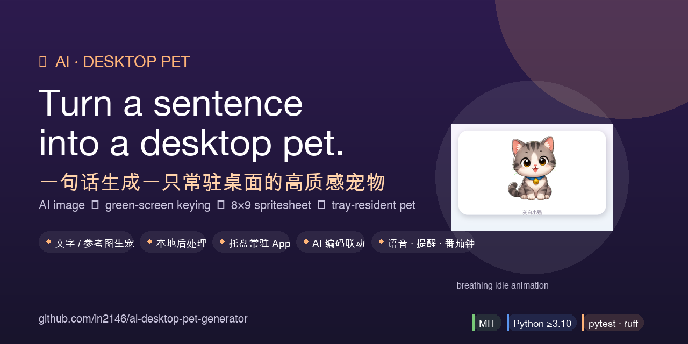
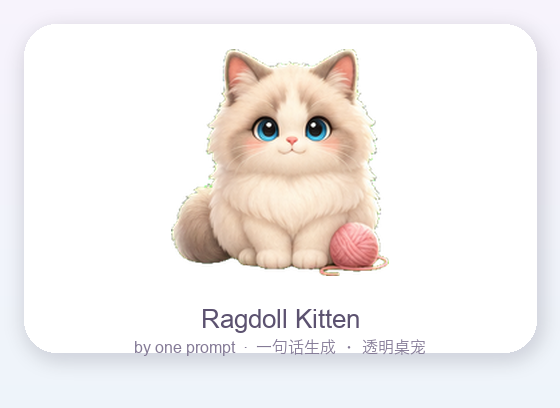
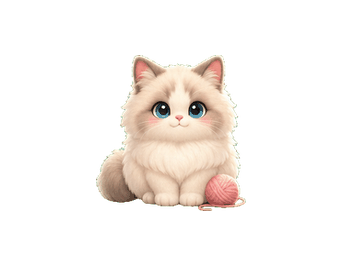
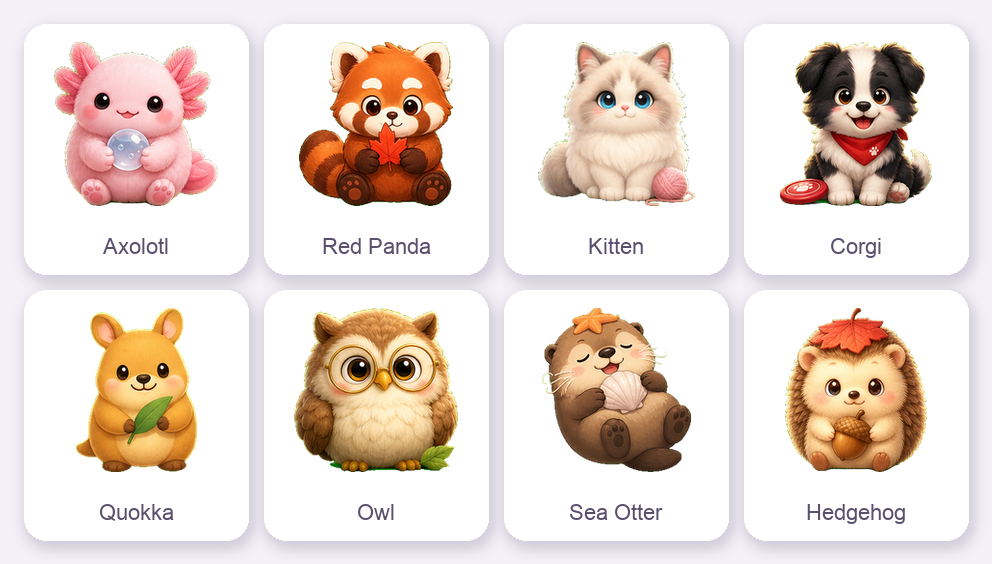
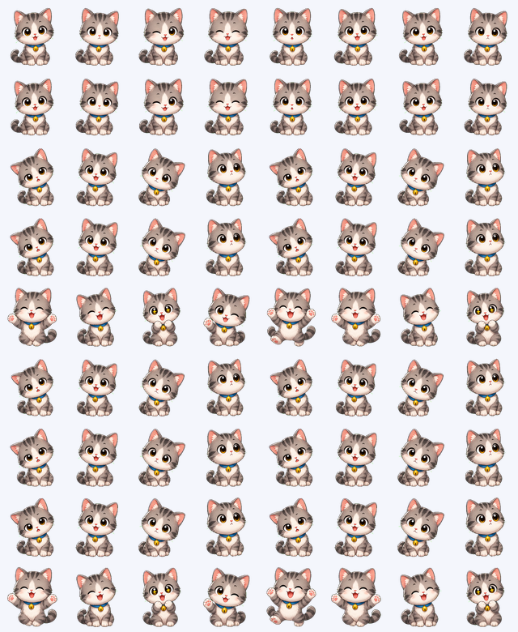

# AI Desktop Pet Generator 🐾

<p align="center">
  
</p>

<p align="center">
  <a href="LICENSE"></a>
  = 3.10">
  
  
</p>

> 🌐 [**中文**](README.md) · **English**

---

## ✨ In One Line

Turn a sentence (or a reference image) into a **high-quality desktop pet that lives in your system tray**.

AI image generation → local green-screen keying → frame slicing → packed `8×9` spritesheet → raise it in your tray — **and it reacts in real time while you code with AI**.

<p align="center">
  <table align="center">
    <tr>
      <td align="center"></td>
      <td align="center"></td>
    </tr>
    <tr>
      <td align="center"><sub><b>Gray-and-white kitten</b> · generated from one sentence / a reference image</sub></td>
      <td align="center"><sub>idle breathing animation</sub></td>
    </tr>
  </table>
</p>

<p align="center">
  <sub>More style-consistent companions:</sub><br>
  
</p>

## 🎯 What It Does

| Capability | Description |
|------|------|
| 🎨 **Text / reference-image generation** | Describe a pet in one line, or feed a reference image to keep its colors and signature accessories. |
| 🧩 **Local post-processing** | Chroma-key background removal, connected-component frame slicing, normalized into a standard pet spritesheet. |
| 🖥️ **Resident tray app** | System tray, floating pet, pet library, settings, speech bubbles, confetti. |
| 🔌 **AI coding integration** | Connects to Claude Code / Codex / Antigravity; the pet reacts when your AI coding tasks complete. |
| 🗣️ **Voice + reminders + pomodoro** | TTS speech, original synthesized SFX, natural-language reminders, 25/5 focus timer. |

## 🚀 Three-Second Start

```bash
python3 -m venv .venv && source .venv/bin/activate
pip install -e ".[desktop]"

# Configure your API key
cp .env.example .env   # then fill in your OPENAI_API_KEY

# Generate a pet from one sentence
petgen generate \
  --prompt "a chubby capybara programmer wearing tiny headphones, gentle and smart" \
  --name "Capybara Coder" \
  --output outputs/capybara-coder

# Launch the tray app and raise it
petgen app
```

<details>
<summary><b>📖 Full usage docs (click to expand)</b></summary>

### Installation

For the desktop pet app:

```bash
python3 -m venv .venv
source .venv/bin/activate
pip install -e ".[desktop]"
```

For development and testing:

```bash
pip install -e ".[dev,desktop]"
```

The core generation pipeline depends on `Pillow`, `requests`, and `numpy`; the desktop app additionally depends on `PySide6` and voice-related capabilities.

### Configuration

The project auto-loads `.env` from the current directory. OpenAI by default:

```bash
OPENAI_API_KEY=sk-...
OPENAI_BASE_URL=https://api.openai.com/v1
OPENAI_IMAGE_MODEL=gpt-image-2
OPENAI_TEXT_MODEL=gpt-4o-mini
```

Or use any OpenAI-compatible endpoint:

```bash
OPENAI_BASE_URL=https://your-compatible-endpoint/v1
OPENAI_API_KEY=your-provider-key
OPENAI_IMAGE_MODEL=gpt-image-2
OPENAI_TEXT_MODEL=your-chat-model
```

### Generate your pet

Text-only generation:

```bash
petgen generate \
  --prompt "a chubby capybara programmer wearing tiny headphones, gentle and smart" \
  --name "Capybara Coder" \
  --output outputs/capybara-coder
```

With a reference image:

```bash
petgen generate \
  --image /path/to/reference.png \
  --prompt "keep the colors and signature accessories, design it as a cute desktop pet" \
  --output outputs/from-reference
```

Process an existing source image only:

```bash
petgen build --source /path/to/source.png --name "Local Pet" --output outputs/local-pet
```

The output directory contains:

- `source.png` — raw model output (`generate` only)
- `sprite.png` — standard `8×9` pet spritesheet (transparent background)
- `pet.json` — animation manifest
- `preview.png` — first-frame preview

<p align="center">
  
  <br><sub>The packed <code>8 × 9</code> spritesheet</sub>
</p>

### Launch the desktop pet app

```bash
petgen app
```

`petgen app` starts the system tray, floating pet, pet library, settings panel, and the AI event bus. Data is stored in `~/.petgen/` by default; override with `$PETGEN_DATA_DIR` or `--data-dir`.

Common entry points:

- **Pet library**: browse, select, preview, and delete pets, or create new ones.
- **Settings**: configure API, models, animations, SFX, voice packs, personality, and tool integrations.
- **Float one quickly**: `petgen desktop outputs/xxx --scale 1.5`.
- **Quick reminders**: natural-language input is supported (e.g. "tomorrow 3pm meeting", "every day 9am drink water", "in 1 hour take meds").

### AI tool integration

The pet reads events written by AI coding tools and switches to the matching expression. GUI path:

```text
petgen app → Settings → 🔌 Tool integration
```

Equivalent CLI commands:

```bash
petgen tools status all
petgen tools connect all
petgen tools disconnect all
petgen event KIND TITLE [DETAIL] [SOURCE]
```

For integration details, legacy hook migration, and the hand-written event protocol, see [docs/integrations.md](docs/integrations.md).

### Source-image conventions

For stable local frame slicing, the model output should follow:

- A single image with a pure `#00FF00` green-screen background.
- 3 action rows: row 1 with 6 idle frames, row 2 with 4 attentive frames, row 3 with 5 happy frames.
- Each frame holds a complete, centered body, with clear green-screen gaps between characters.
- The character body should not be predominantly green; a same-color foreground cannot be separated from the green screen by color alone.

</details>

## 📚 More Docs

> Note: the in-repo docs are written in Chinese; the codebase, CLI, and this README are fully English-accessible.

- [docs/development.md](docs/development.md): development, testing, lint, wheel build, and release checks.
- [docs/integrations.md](docs/integrations.md): Claude Code / Codex / Antigravity integration.
- [docs/architecture.md](docs/architecture.md): generation pipeline, runtime components, storage, and fault tolerance.
- [docs/troubleshooting.md](docs/troubleshooting.md): common issues — API, PySide6, SFX, reminders, frame-slicing failures.

---

## 🔧 Tech Stack

`Python ≥3.10` · `PySide6` · `Pillow` + `numpy` (image pipeline) · `requests` · `edge-tts` / Fish Audio (voice) · `pytest` + `ruff` · MIT License

## 🤝 Contributing

Issues and PRs are welcome! Dev setup:

```bash
pip install -e ".[dev,desktop]"
pytest              # 319 tests
ruff check .        # lint
```

## 📄 License

[MIT](LICENSE)
