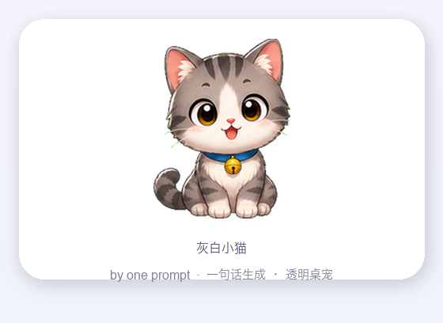
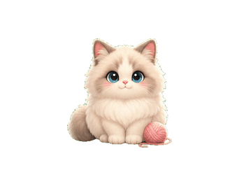
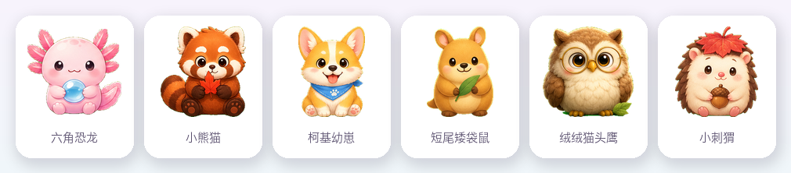
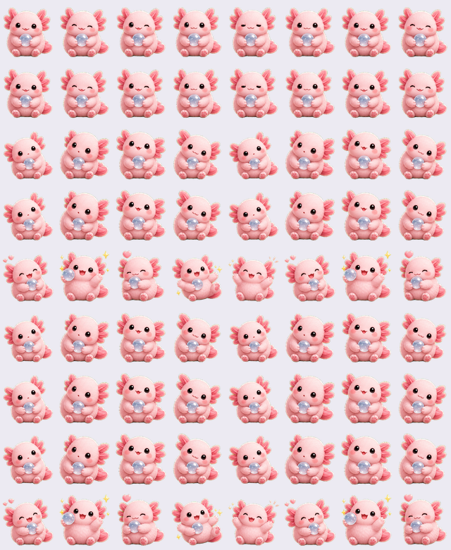

# AI Desktop Pet Generator 🐾

<p align="center">
  <table align="center">
    <tr>
      <td align="center"></td>
      <td align="center"></td>
    </tr>
    <tr>
      <td align="center"><sub><b>灰白小猫</b> · 由一句话 / 参考图生成</sub></td>
      <td align="center"><sub>idle 呼吸动画</sub></td>
    </tr>
  </table>
</p>

<p align="center">
  
  = 3.10">
  
</p>

<p align="center">
  把一句话（或一张参考图）变成一只<sub>　</sub><b>常驻桌面的高质感宠物</b>。<br>
  AI 生图 → 本地绿幕抠图 → 切帧打包成 <code>8×9</code> 精灵表 → 在系统托盘里养起来，<br>还能在你用 AI 写代码时实时做出反应。
</p>

<p align="center">
  <sub>更多画风一致的伙伴：</sub><br>
  
</p>

---

## 目录

- [它能做什么](#它能做什么)
- [安装](#安装)
- [配置](#配置)
- [生成你的桌宠](#生成你的桌宠)
- [输出](#输出)
- [验证](#验证)
- [常驻桌宠 App](#常驻桌宠-app)
  - [功能一览](#功能一览)
  - [让 AI 写代码时桌宠实时反应](#让-ai-写代码时桌宠实时反应事件总线--工具接入)
  - [语音包](#语音包说话--音效)
  - [提醒 + 番茄钟](#提醒--番茄钟)
- [图像源图约定](#图像源图约定)
- [工程与健壮性](#工程与健壮性)
- [许可](#许可)

---

## 它能做什么

- 🎨 **文字 / 参考图生宠** — 一句描述，或丢一张参考图保留配色与标志配饰。
- ✨ **描述增强** — 描述太短（< 30 字）时自动补全外观 / 配色 / 性格 / 画风。
- 🧩 **本地后处理** — `#00FF00` 绿幕抠图（去绿边、保护浅色主体）、连通域切帧、归一打包，纯本地。
- 🖥️ **常驻桌宠 App** — 托盘 + 悬浮宠物 + 宠物库 + 设置；6 态表情 + 气泡 + 完成撒花。
- 🔌 **AI 编码联动** — 一键接通 Claude Code / Codex / Antigravity，写代码时桌宠实时反应。
- 🗣️ **语音包 + ⏰ 提醒 + 🍅 番茄钟** — TTS 说话 + 正弦波音效（零版权）；中文自然语言提醒；25/5 专注。

## 安装

```bash
cd /Users/loge/A_project/ai-desktop-pet-generator
python3 -m venv .venv
source .venv/bin/activate
pip install -e ".[dev]"        # 核心 + 测试 / lint
pip install -e ".[desktop]"    # 常驻桌宠 App 所需的 PySide6
```

> 核心依赖为 `Pillow` + `requests` + `numpy`（抠图 / 切帧的向量化加速，`pip install -e` 会自动带上）。

## 配置

项目会自动读取当前目录下的 `.env`。默认使用 OpenAI：

```bash
OPENAI_API_KEY=sk-...
OPENAI_BASE_URL=https://api.openai.com/v1
OPENAI_IMAGE_MODEL=gpt-image-2
OPENAI_TEXT_MODEL=gpt-4o-mini     # 可选：描述增强用的文本模型
```

OpenAI 兼容代理：

```bash
OPENAI_BASE_URL=https://your-compatible-endpoint/v1
OPENAI_API_KEY=your-provider-key
OPENAI_IMAGE_MODEL=gpt-image-2
OPENAI_TEXT_MODEL=your-chat-model
```

网络重试（图像 / 文本独立；遇 429 / 5xx / 连接 / 超时自动退避，默认 3 次）：

```bash
OPENAI_IMAGE_MAX_ATTEMPTS=3
OPENAI_TEXT_MAX_ATTEMPTS=3
```

## 生成你的桌宠

**纯文字生成**

```bash
petgen generate \
  --prompt "一只圆滚滚的水豚程序员，戴小耳机，温柔、聪明、适合陪伴写代码" \
  --name "水豚程序员" --output outputs/capybara-coder
```

**带参考图生成**（有参考图时走 `/images/edits`，否则走 `/images/generations`）

```bash
petgen generate --image /path/to/reference.png \
  --prompt "保留颜色和标志性配饰，设计成可爱桌面宠物" --output outputs/from-reference
# --prompt 可省略，会使用内置默认描述：把参考图形象原样转成可爱桌宠，保留颜色/轮廓/配饰/性格
```

**描述增强** — 描述过短（strip 后 < 30 字）自动触发，也可用 `--enrich` / `--no-enrich` 强制开关；增强失败只 warning 并回退原描述，不中断生图；增强结果超长会被截断以免污染图像 prompt。

**只处理已有源图** — 已有三行动作源图时可跳过 API 直接打包：

```bash
petgen build --source /path/to/source.png --name "本地桌宠" --output outputs/local-pet
```

## 输出

每次输出目录包含：

- `source.png` — 模型原始返回图（仅 `generate` 写入）
- `sprite.png` — 标准 `8 x 9` 桌宠 spritesheet（**透明通道**）
- `pet.json` — 动画 manifest（`description` 始终是你的原始描述；触发增强时额外记录 `_generation.enrichedDescription`）
- `preview.png` — 首帧预览图

<p align="center">
  
  <br><sub>打包出的 <code>8 × 9</code> 精灵表（透明通道，这里铺了浅底便于查看）</sub>
</p>

## 验证

```bash
ruff check .          # 静态检查（规则集刻意保守：F/E9/I，不做格式化）
pytest                # 行为测试；GUI 用 QT_QPA_PLATFORM=offscreen 自检
```

测试只验证本地后处理、请求配置与 GUI 逻辑，**不会发起真实网络生图请求**。两者都已接入 GitHub Actions（push / PR 自动跑 `ruff check .` + offscreen `pytest`，矩阵 Python 3.10 / 3.12）。

## 常驻桌宠 App

```bash
pip install -e ".[desktop]"
petgen app
```

`petgen app` 启动：系统托盘（主控制面）、悬浮宠物、按需打开的**宠物库**与**设置**，以及 **AI 事件总线**。数据全部存在 `~/.petgen/`（可用 `$PETGEN_DATA_DIR` / `--data-dir` 覆盖）：`petgen.sqlite`、`pets/<id>/`、`task-events.jsonl`。

### 功能一览

- **宠物库**（托盘「打开宠物库…」）— 浏览 / 选择 / 预览 / 删除；「✨ 创建新宠物…」后台跑流水线并自动入库（生图在子线程、登记回主线程）。`petgen generate` 成功默认也拷进库（`--no-register` 关闭）。
- **设置**（托盘「设置…」）— AI key/base_url/模型、缩放、动画/音效开关、人格（温暖/元气/沉稳/傲娇），及下面的「🔌 工具接入」。
- **悬浮宠物** — 6 态动画（idle/attentive/happy/busy/alert/error）+ 表情叠加 + 气泡 + 撒花；左键互动台词、右键菜单、可拖动、透明区穿透；气泡强制纯文本，外部标题不会被当富文本渲染。
- **快速浮一只** — `petgen desktop outputs/xxx --scale 1.5`（不走库/托盘）。

### 让 AI 写代码时桌宠实时反应（事件总线 + 工具接入）

任何外部进程往 `~/.petgen/task-events.jsonl` 追加一行 JSON，桌宠约 2 秒内用对应表情回应（thinking→busy、responding→attentive、completed→happy、error→error）。契约语言无关：`{"id","kind","title","detail","source","createdAt"}`。读取端按字节增量读、对中文等多字节标题偏移精确、超长/畸形行只记一条聚合告警，外部写坏也不拖垮 GUI。

**手写钩子**（如 Claude Code 的 `~/.claude/settings.json`，附带脚本 `scripts/petgen-event.sh`）：

```jsonc
{
  "hooks": {
    "PreToolUse":  [{"hooks": [{"type": "command", "command": "/abs/path/scripts/petgen-event.sh ai_thinking \"思考中\" \"\" claude_code"}]}],
    "PostToolUse": [{"hooks": [{"type": "command", "command": "/abs/path/scripts/petgen-event.sh ai_responding \"回复中\" \"\" claude_code"}]}],
    "Stop":        [{"hooks": [{"type": "command", "command": "/abs/path/scripts/petgen-event.sh task_completed \"完成一轮\" \"\" claude_code"}]}]
  }
}
```

**一键接通三个工具（GUI 点按钮）**：`petgen app` →「设置」→「**🔌 工具接入**」tab，**Claude Code / Codex / Antigravity（反重力）** 各一行状态 + 接通/断开按钮，点按**即时生效**（与「保存设置」无关），还有「⚡ 一键全部接通」。接线以**追加/共存**方式进行，不碰其他桌宠（如 ai-pet-reminder）的钩子，改动前自动备份 `*.bak.<时间戳>`（撤销 = 还原备份）：

- **Claude Code** — 往 `~/.claude/settings.json` 追加 `Stop` / `SubagentStop` 钩子（每轮任务 / 子任务完成时桌宠庆祝）
- **Codex** — 把 `~/.codex/config.toml` 的 `notify` 指向 `petgen codex-notify`；原 notify 记在 `~/.petgen/codex-notify-original`（JSON：argv + 原始整行），运行期链式调用、断开时逐字还原
- **Antigravity** — 写入 `~/.gemini/config/hooks.json` 独立键 `petgen-notify`（该渠道的实际触发尚待真机验证）

四种状态：✅ 已接通 / ⚠️ 需重连（venv 迁移后钩子路径失效，点「重连」自愈）/ ○ 未接通 / 未检测到（按钮禁用）。

**CLI 等价命令**（SSH / CI / 无 GUI 场景）：

```bash
petgen tools status|connect|disconnect {claude|codex|antigravity|all}
petgen event KIND TITLE [DETAIL] [SOURCE]   # 钩子实际调用的写事件命令，失败也永远退出 0
```

> **从 bash 版钩子迁移（开发机注意）**：早期 `scripts/hooks/install-hooks.sh` 把**仓库绝对路径**写进配置，已被 GUI/CLI 版取代（钩子命令改为 `petgen` 可执行文件本身，随 pip 升级不漂移）。若配置里残留指向本仓库 `scripts/hooks/` 的旧钩子，接通新版后会**双份事件**，请先手动清理（产品代码不自动删他家条目）：Claude Code 删 `~/.claude/settings.json` 中 command 含 `ai-desktop-pet-generator/scripts/hooks/` 的钩子组；Codex 把 `notify` 还原为安装前的值（原值记录在 `~/.petgen/codex-notify-original`）后删除该记录文件；Antigravity 无需处理（GUI 接通会覆盖同名 `petgen-notify` 键）。另注：钩子固定写 `~/.petgen`，不跟随 app 的 `--data-dir`；接线仅支持 macOS / Linux，Windows 上按钮置灰（钩子 shell 语义不兼容）。

> 说明：托盘图标、屏上穿透手感、气泡锚定等需在真机目检；无显示器环境用 `QT_QPA_PLATFORM=offscreen` 跑的是渲染/逻辑自检。macOS 上以裸 `python` 运行时 Dock 仍可能短暂出现图标（打成 `.app` 才能彻底去除，留作后续）。

### 语音包（说话 + 音效）

设置「🐶 宠物行为 → 语音包」切换，支持 ▶ 试听。内置三包：**软萌喵 🐱 / 元气电波 ⚡ / 沉稳管家 🎩**，各带语种/音色偏好与台词池。

- **说话**用 TTS 实时合成，**反馈音效**由正弦波现场合成（pop / 叮咚 / 庆祝 / 嗡 / 嘀嗒）——**不打包任何第三方录音，零版权**。
- 触发：点击 = `tap`；AI 事件按 kind 映射。「安静模式」一并静音；「开启音效反馈」可总开关。
- 音效在 `src/petgen/resources/_sfx/`，可用 `python scripts/make_voice_sfx.py` 重生成；播放器用完即释放并有上限池，常驻数天不泄漏。
- 想用**真人录的开源音效**？把 CC0/CC-BY 的 wav 放进 `_sfx/` 并在该包 `sounds` 写文件名即可（**不**默认打包）。推荐：[OpenGameArt CC0](https://opengameart.org/content/cc0-sound-effects)、[freesound CC0 UI 包](https://freesound.org/people/GameAudio/packs/13940/)、[itch.io CC0](https://itch.io/game-assets/assets-cc0/tag-sound-effects)。

### 提醒 + 番茄钟

- **＋ 快速记提醒** — 一句话 + 中文自然语言时间（「明天下午三点 开会」「每天 9点 喝水」「周一 10点 周会」「1小时后 吃药」）；解析不了就整句当标题、默认 +1 小时。
- **提醒列表…** — 查看/完成/稍后/编辑/删除；不重复/每天/工作日/每周/每月/自定义星期；到期弹气泡（带「完成/稍后」）并切 alert。数据存 `petgen.sqlite`（带 schema 版本 + WAL，跨版本自动迁移）。
- **🍅 番茄钟…** — 25 分钟专注 / 5 分钟休息，开始/暂停/重置/跳过；阶段结束庆祝 + 语音。

> 到期检测每 20 秒轮询一次；「安静模式」期间提醒气泡与番茄钟提示也静音（事件仍记录）。

## 图像源图约定

为让本地切图稳定，模型输出应尽量遵守：

- 单张图，纯 `#00FF00` 绿幕背景
- 3 行动作：第 1 行 6 帧 idle、第 2 行 4 帧 attentive、第 3 行 5 帧 happy
- 每帧完整身体、居中、角色之间留明显绿幕间隔
- **角色本体不要以绿色为主**（纯绿 / 草绿 / 嫩绿的青蛙、龙、多肉等）：同色前景与绿幕无法仅靠颜色分离，会出现带洞的 sprite。概念偏绿时请给对比色肚皮 / 描边 / 配色。提示词已自带此约束。

## 工程与健壮性

> 给维护者看的“防线”概述。

- **分层清晰** — 生成 `envfile → prompt → openai_* → spritesheet → pet_manifest → animation`；运行时 `store → eventbus → reminder* → integrations → coordinator → tray → desktop_window`，多数组件可脱离 GUI 单测。
- **抠图 / 切帧** — numpy 向量化；2D 连通域 + 单连通域掩膜切帧，避免相贴角色串帧；浅色主体去绿边且不误伤绿色角色边缘。
- **网络** — 429 / 5xx / 连接 / 超时退避重试；生图子线程、登记回主线程（规避 sqlite 跨线程）。
- **存储** — `PRAGMA user_version` 顺序迁移 + WAL；损坏 settings JSON 降级为默认值。
- **manifest** — 拒绝 `spritesheetPath` 越界；损坏 sprite 统一抛 `ManifestError`。
- **启动容错** — 单个损坏/缺失素材不拖垮 App，跳过并提示。
- **测试 / lint / CI** — `pytest` + `ruff`，GitHub Actions 在 push/PR 自动跑（offscreen）。

## 许可

[MIT](LICENSE)。
