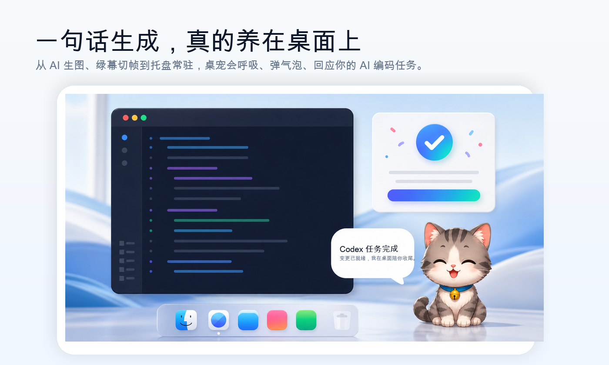
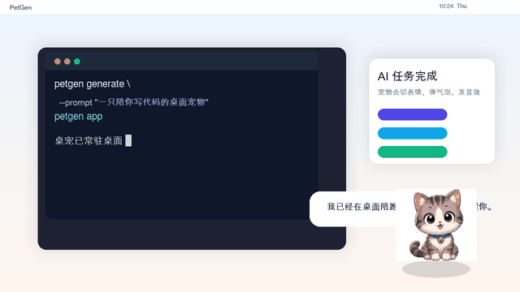
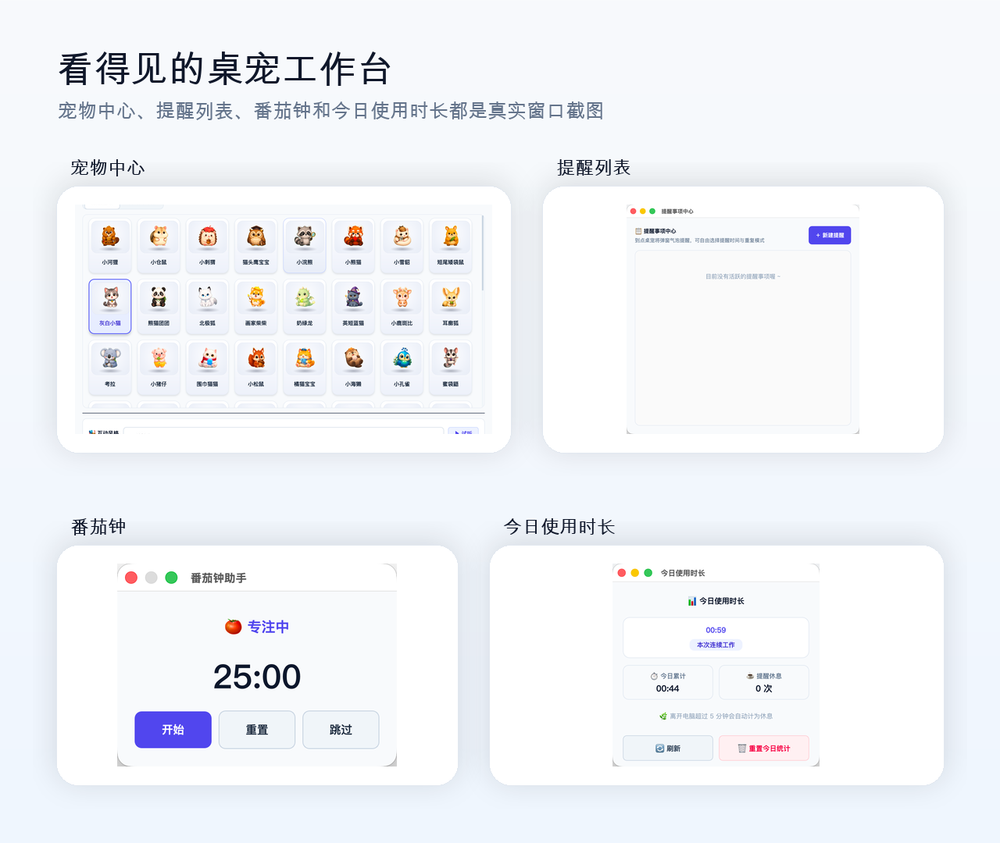
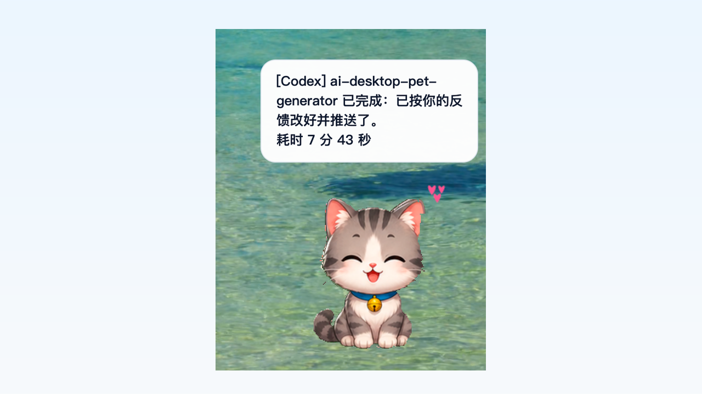

# AI 桌面宠物生成器

<p align="center">
  <a href="README.md"><b>中文</b></a> · <a href="README_EN.md">English</a>
</p>

<p align="center">
  <a href="LICENSE"></a>
  = 3.10">
  
  
</p>

把一句话，或一张参考图，变成一只常驻桌面的高质感宠物。

它会完成从 AI 生图到本地切帧的整条链路：生成形象、绿幕抠图、切帧、打包成 `8 x 9` 精灵表，然后通过托盘应用把宠物养在桌面上。你也可以把它接入 Claude Code、Codex、Antigravity 等 AI 编码工具，让任务状态实时变成桌宠表情、气泡和音效反馈。

<p align="center">
  
  <br>
  <sub>一句话生成、绿幕切帧、托盘常驻，桌宠会呼吸、弹气泡，并回应 AI 编码任务。</sub>
</p>

## 精选伙伴

每一只都由一句话生成，画风一致，可以直接养在桌面。

<p align="center">
  <table align="center">
    <tr>
      <td align="center"></td>
      <td align="center"></td>
      <td align="center"></td>
      <td align="center"></td>
      <td align="center"></td>
      <td align="center"></td>
    </tr>
    <tr>
      <td align="center"><sub><b>灰白小猫</b></sub></td>
      <td align="center"><sub><b>熊猫团团</b></sub></td>
      <td align="center"><sub><b>北极狐</b></sub></td>
      <td align="center"><sub><b>橘猫宝宝</b></sub></td>
      <td align="center"><sub><b>奶绿龙</b></sub></td>
      <td align="center"><sub><b>柯基幼崽</b></sub></td>
    </tr>
  </table>
</p>

## 真实运行

不只是预览图，这是 `petgen app` 跑起来后的核心体验：悬浮宠物常驻桌面、有呼吸动画，宠物中心可以浏览、切换、管理你养的所有伙伴，今日使用时长面板会记录连续工作和休息提醒。

<p align="center">
  <table align="center">
    <tr>
      <td align="center">
        
      </td>
      <td align="center">
        
      </td>
    </tr>
    <tr>
      <td align="center"><sub>桌面运行 · 呼吸动画 / 气泡反馈</sub></td>
      <td align="center"><sub>宠物工作台 · 宠物中心 / 健康提醒</sub></td>
    </tr>
  </table>
</p>

静态截图：

<p align="center">
  
  
</p>

## 小红书素材

已经准备好一组可直接发帖或二次排版的素材：

- 封面图：[docs/social/xhs-cover.png](docs/social/xhs-cover.png)
- 桌面运行竖图：[docs/social/xhs-desktop-running.png](docs/social/xhs-desktop-running.png)
- 界面展示竖图：[docs/social/xhs-ui-showcase.png](docs/social/xhs-ui-showcase.png)
- 4.8 秒短视频：[docs/social/petgen-desktop-demo.mp4](docs/social/petgen-desktop-demo.mp4)

如需重新生成这些素材：

```bash
QT_QPA_PLATFORM=offscreen python scripts/make_readme_media.py
```

## 功能概览

| 功能 | 说明 |
|------|------|
| 文字 / 参考图生宠 | 用一句描述生成宠物，或通过参考图保留颜色、轮廓和标志性配饰 |
| 本地后处理 | 绿幕抠图、连通域切帧、归一化，并打包成标准桌宠精灵表 |
| 常驻托盘应用 | 支持系统托盘、悬浮宠物、宠物中心、设置面板、气泡和撒花 |
| AI 编码联动 | 可接入 Claude Code、Codex、Antigravity，任务完成时桌宠实时回应 |
| 语音、提醒、番茄钟 | 支持 TTS 说话、原创合成音效、中文自然语言提醒和 25/5 专注计时 |

## 快速开始

```bash
python3 -m venv .venv
source .venv/bin/activate
pip install -e ".[desktop]"

cp .env.example .env
# 然后在 .env 中填入 OPENAI_API_KEY
```

生成一只桌宠：

```bash
petgen generate \
  --prompt "一只圆滚滚的水豚程序员，戴小耳机，温柔、聪明、适合陪伴写代码" \
  --name "水豚程序员" \
  --output outputs/capybara-coder
```

启动桌宠应用：

```bash
petgen app
```

## 配置

项目会自动读取当前目录下的 `.env`。默认使用 OpenAI：

```bash
OPENAI_API_KEY=sk-...
OPENAI_BASE_URL=https://api.openai.com/v1
OPENAI_IMAGE_MODEL=gpt-image-2
OPENAI_TEXT_MODEL=gpt-4o-mini
```

也可以使用兼容 OpenAI 协议的代理或中转服务：

```bash
OPENAI_BASE_URL=https://your-compatible-endpoint/v1
OPENAI_API_KEY=your-provider-key
OPENAI_IMAGE_MODEL=gpt-image-2
OPENAI_TEXT_MODEL=your-chat-model
```

## 常用命令

纯文字生成：

```bash
petgen generate \
  --prompt "一只圆滚滚的水豚程序员，戴小耳机，温柔、聪明、适合陪伴写代码" \
  --name "水豚程序员" \
  --output outputs/capybara-coder
```

带参考图生成：

```bash
petgen generate \
  --image /path/to/reference.png \
  --prompt "保留颜色和标志性配饰，设计成可爱桌面宠物" \
  --output outputs/from-reference
```

只处理已有源图：

```bash
petgen build --source /path/to/source.png --name "本地桌宠" --output outputs/local-pet
```

快速浮起一只已有桌宠：

```bash
petgen desktop outputs/capybara-coder --scale 1.5
```

## 生成结果

输出目录包含：

- `source.png`：模型原始返回图，仅 `generate` 会写入。
- `sprite.png`：标准 `8 x 9` 桌宠精灵表，背景透明。
- `pet.json`：动画配置和生成信息。
- `preview.png`：首帧预览图。

<p align="center">
  
  <br><sub>「灰白小猫」打包出的 <code>8 x 9</code> 精灵表</sub>
</p>

## 桌宠应用

```bash
petgen app
```

`petgen app` 会启动系统托盘、悬浮宠物、宠物中心、设置面板和 AI 事件总线。数据默认存放在 `~/.petgen/`，也可以用 `$PETGEN_DATA_DIR` 或 `--data-dir` 覆盖。

常用入口：

- 宠物中心：浏览、选择、预览、删除宠物，也可以创建新宠物。
- 设置中心：配置 API、模型、动画、音效、语音包、互动风格和工具接入。
- 快速提醒：支持「明天下午三点 开会」「每天 9点 喝水」「1小时后 吃药」。
- 番茄钟：内置 25/5 专注计时，到点后桌宠会提醒。

## AI 工具接入

桌宠可以读取 AI 编码工具写入的事件，并切换到对应表情。应用内路径：

```text
petgen app -> 设置中心 -> 工具接入
```

命令行等价操作：

```bash
petgen tools status all
petgen tools connect all
petgen tools disconnect all
petgen event KIND TITLE [DETAIL] [SOURCE]
```

接入细节、旧 hook 迁移和手写事件协议见 [docs/integrations.md](docs/integrations.md)。

## 源图约定

为让本地切图稳定，模型输出应尽量遵守：

- 单张图，纯 `#00FF00` 绿幕背景。
- 3 行动作：第 1 行 6 帧 idle，第 2 行 4 帧 attentive，第 3 行 5 帧 happy。
- 每帧完整身体、居中，角色之间留明显绿幕间隔。
- 角色本体不要以绿色为主；同色前景与绿幕无法仅靠颜色分离。

## 开发

```bash
pip install -e ".[dev,desktop]"
pytest
ruff check .
python -m pip wheel . --no-deps -w /tmp/petgen-wheel
```

## 文档

- [开发指南](docs/development.md)：开发、测试、lint、wheel 构建和发布检查。
- [工具接入](docs/integrations.md)：Claude Code、Codex、Antigravity 接入说明。
- [架构概览](docs/architecture.md)：生成链路、运行时组件、存储和容错设计。
- [排障指南](docs/troubleshooting.md)：API、PySide6、音效、提醒、切图失败等常见问题。

## 技术栈

`Python >= 3.10` · `PySide6` · `Pillow` · `numpy` · `requests` · `edge-tts` · `pytest` · `ruff`

## 贡献

欢迎提交 Issue 和 PR。提交前建议至少运行：

```bash
pytest
ruff check .
```

## 许可

[MIT](LICENSE)
