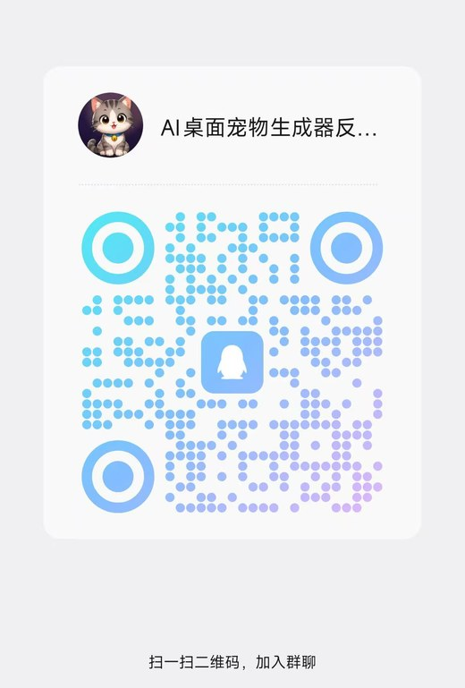

<p align="center">
  
</p>

<h1 align="center">AI 桌面宠物生成器</h1>

<p align="center">
  把一句话，或一张参考图，变成一只常驻桌面的可爱宠物。
</p>

<p align="center">
  <a href="README.md"><b>中文</b></a> · <a href="README_EN.md">English</a>
</p>

<p align="center">
  <a href="LICENSE"></a>
  
  <a href="https://github.com/ln2146/ai-desktop-pet-generator/releases"></a>
</p>

PetGen 会把宠物养在桌面上：它可以呼吸、弹气泡、提醒你休息，也能在 Codex / Claude Code / Antigravity 任务完成时给你一个轻轻的反馈。你可以直接使用内置宠物，也可以自己生成新的形象。

<p align="center">
  
  <br>
  <sub>桌面通知、休息提醒、宠物中心、提醒列表、番茄钟和今日使用时长。</sub>
</p>

<p align="center">
  
  <br>
  <sub>灰白小猫持续动作预览。</sub>
</p>

## 精选伙伴

每一只都由一句话生成，画风一致，可以直接养在桌面。

<p align="center">
  <table align="center">
    <tr>
      <td align="center"></td>
      <td align="center"></td>
      <td align="center"></td>
      <td align="center"></td>
      <td align="center"></td>
      <td align="center"></td>
    </tr>
    <tr>
      <td align="center"><sub><b>灰白小猫</b></sub></td>
      <td align="center"><sub><b>熊猫团团</b></sub></td>
      <td align="center"><sub><b>北极狐</b></sub></td>
      <td align="center"><sub><b>橘猫宝宝</b></sub></td>
      <td align="center"><sub><b>奶绿龙</b></sub></td>
      <td align="center"><sub><b>柯基幼崽</b></sub></td>
    </tr>
  </table>
</p>

## 功能概览

| 功能 | 说明 |
|------|------|
| 桌面陪伴 | 宠物常驻桌面，支持呼吸动画、气泡反馈和表情切换 |
| 宠物中心 | 浏览、切换、导入和管理你的桌宠伙伴 |
| 休息提醒 | 连续使用电脑一段时间后，宠物会提醒你活动一下 |
| 番茄钟 | 内置 25 分钟专注计时，到点后桌宠提醒 |
| 今日使用时长 | 查看本次连续工作、今日累计和提醒次数 |
| AI 任务反馈 | Codex / Claude Code / Antigravity 完成任务时，桌宠可以弹出通知 |

## 下载体验

不想折腾环境的话，直接从 Release 下载应用包：

<p align="center">
  <a href="https://github.com/ln2146/ai-desktop-pet-generator/releases"><b>前往 Releases 下载最新版</b></a>
</p>

下载后启动桌宠应用，就可以在托盘里打开宠物中心、提醒列表、番茄钟和使用时长面板。想自己生成新宠物时，再配置 AI Key 即可。

## 用户反馈群

使用中遇到问题、想提建议，或想交流自己生成的桌宠，可以加入 QQ 用户反馈群。

<p align="center">
  
  <br>
  <sub>QQ群：914057336</sub>
</p>

## 自己生成宠物

如果你想用一句话或参考图生成新的宠物，需要先准备 OpenAI（或兼容 OpenAI 接口）的 API Key。项目会读取当前目录下的 `.env`（参考 `.env.example`）：

```bash
OPENAI_API_KEY=sk-...
OPENAI_BASE_URL=https://api.openai.com/v1   # 可选，兼容 OpenAI 接口的第三方网关填这里
OPENAI_IMAGE_MODEL=gpt-image-2              # 可选，默认 gpt-image-2
OPENAI_TEXT_MODEL=gpt-4o-mini               # 可选，描述过短时自动调用做描述增强
OPENAI_IMAGE_SIZE=1536x1024                 # 可选，默认 1536x1024
OPENAI_IMAGE_QUALITY=high                   # 可选，默认 high
```

也可以用命令行参数覆盖，例如 `--size`、`--quality`、`--base-url`，详见 `petgen generate --help`。

从源码运行：

```bash
python3 -m venv .venv
source .venv/bin/activate
pip install -e ".[desktop]"
petgen app
```

生成一只新宠物：

```bash
petgen generate \
  --prompt "一只圆滚滚的水豚程序员，戴小耳机，温柔、聪明、适合陪伴写代码" \
  --name "水豚程序员" \
  --output outputs/capybara-coder
```

也可以带参考图生成：

```bash
petgen generate \
  --image /path/to/reference.png \
  --prompt "保留颜色和标志性配饰，设计成可爱桌面宠物" \
  --output outputs/from-reference
```

## 进阶文档

- [工具接入](docs/integrations.md)：连接 Claude Code、Codex、Antigravity，让任务完成时触发桌宠反馈。
- [排障指南](docs/troubleshooting.md)：API、PySide6、音效、提醒、切图失败等常见问题。
- [开发指南](docs/development.md)：开发、测试、lint、wheel 构建和发布检查。
- [架构概览](docs/architecture.md)：生成链路、运行时组件、存储设计。

## 开发者

```bash
pip install -e ".[dev,desktop]"
pytest
ruff check .
python -m pip wheel . --no-deps -w /tmp/petgen-wheel
```

## 许可

[MIT](LICENSE)
